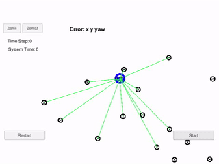
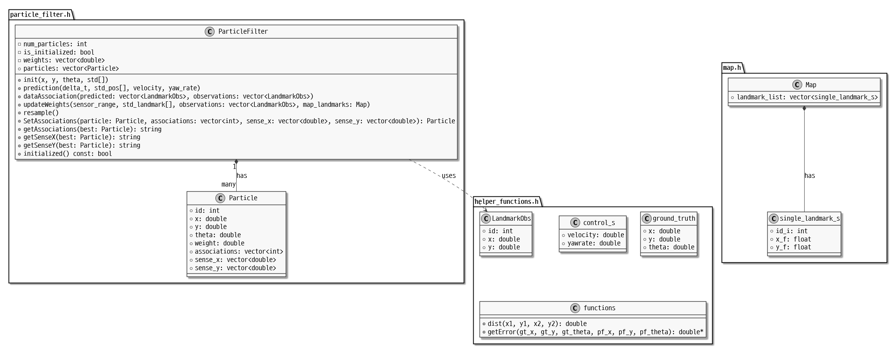
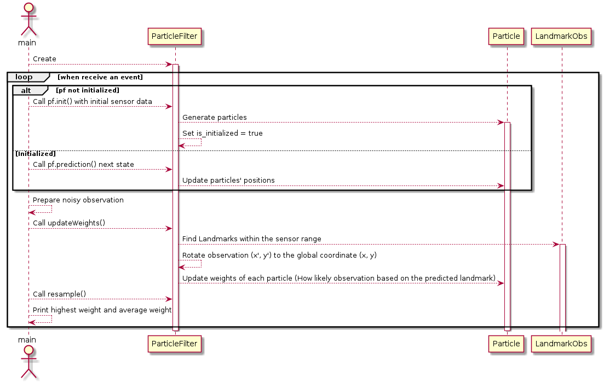

- [Description](#sec-1)
- [Visualization](#sec-2)
  - [GIF](#sec-2-1)
  - [UML](#sec-2-2)
    - [Class Diagram](#sec-2-2-1)
    - [Sequence Diagram](#sec-2-2-2)
- [BUILD](#sec-3)
  - [Dependencies](#sec-3-1)
  - [Build](#sec-3-2)
  - [Run](#sec-3-3)


# Description<a id="sec-1"></a>

Particle Filter Project Using [Udacity's simulator](https://github.com/udacity/self-driving-car-sim/releases)

# Visualization<a id="sec-2"></a>

## GIF<a id="sec-2-1"></a>



## UML<a id="sec-2-2"></a>

### Class Diagram<a id="sec-2-2-1"></a>



### Sequence Diagram<a id="sec-2-2-2"></a>



# BUILD<a id="sec-3"></a>

## Dependencies<a id="sec-3-1"></a>

```bash
bash ./install-ubuntu.sh # OSX: bash ./install-mac.sh
```

## Build<a id="sec-3-2"></a>

```bash
bash ./build.sh
```

## Run<a id="sec-3-3"></a>

```bash
bash ./run.sh
```

and run the Udacity simulator
